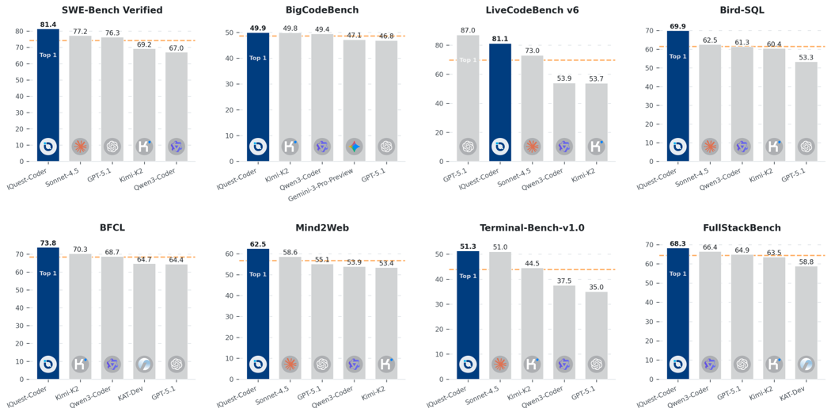

# IQuest-Coder-V1 Model Family

- IQuest-Coder-V1-40B-Base-Stage1
- IQuest-Coder-V1-40B-Base
- IQuest-Coder-V1-40B-Instruct
- IQuest-Coder-V1-40B-Loop-Instruct
- IQuest-Coder-V1-40B-Thinking
- IQuest-Coder-V1-40B-Loop-Thinking

## IQuest-Coder-V1 Highlights

IQuest-Coder-V1 is a new family of code large language models (LLMs) designed to advance autonomous software engineering and code intelligence. Built on the innovative code-flow multi-stage training paradigm, IQuest-Coder-V1 captures the dynamic evolution of software logic, delivering state-of-the-art performance across critical dimensions:

- **State-of-the-Art Performance**: Achieves leading results on SWE-Bench Verified (81.4%), BigCodeBench (51.4%), LiveCodeBench v6 (87.0%), and other major coding benchmarks, surpassing competitive models across agentic software engineering, competitive programming, and complex tool use.
- **Code-Flow Training Paradigm**: Moving beyond static code representations, our models learn from repository evolution patterns, commit transitions, and dynamic code transformations to understand real-world software development processes.
- **Dual Specialization Paths**: Bifurcated post-training delivers two specialized variants—Thinking models (utilizing reasoning-driven RL for complex problem-solving) and Instruct models (optimized for general coding assistance and instruction-following).
- **Efficient Architecture**: The IQuest-Coder-V1-Loop variant introduces a recurrent mechanism that optimizes the trade-off between model capacity and deployment footprint.
- **Native Long Context**: All models natively support up to 128K tokens without requiring additional scaling techniques.

## Model Overview

The IQuest-Coder-V1 series includes models ranging from 7B to 40B parameters, with both standard and Loop variants:

| Model | Parameters | Layers | Hidden Size | Attention Heads (Q/KV) | Context Length |
|-------|------------|--------|-------------|------------------------|----------------|
| IQuest-Coder-V1-7B-Instruct | 7B | 14 | 5120 | 40/8 | 128K |
| IQuest-Coder-V1-7B-Thinking | 7B | 14 | 5120 | 40/8 | 128K |
| IQuest-Coder-V1-14B-Instruct | 14B | 28 | 5120 | 40/8 | 128K |
| IQuest-Coder-V1-14B-Thinking | 14B | 28 | 5120 | 40/8 | 128K |
| IQuest-Coder-V1-40B-Instruct | 40B | 80 | 5120 | 40/8 | 128K |
| IQuest-Coder-V1-40B-Thinking | 40B | 80 | 5120 | 40/8 | 128K |
| IQuest-Coder-V1-40B-Loop-Instruct | 40B | 80 (2 iterations) | 5120 | 40/8 | 128K |
| IQuest-Coder-V1-40B-Loop-Thinking | 40B | 80 (2 iterations) | 5120 | 40/8 | 128K |

**Architecture Features:**

- Grouped Query Attention (GQA) for efficient inference
- Native 128K context length support
- Vocabulary size: 76,800 tokens
- Loop variants use recurrent transformer design with shared parameters across two iterations

For more details, please refer to our Technical Report, GitHub.

## Quickstart

IQuest-Coder-V1 uses custom modeling code via Hugging Face's auto_map feature. We recommend using transformers>=4.52.4.

### Basic Usage with Transformers

```python
from transformers import AutoModelForCausalLM, AutoTokenizer

model_name = "IQuest/IQuest-Coder-V1-40B-Instruct"

# Load the tokenizer and model
tokenizer = AutoTokenizer.from_pretrained(model_name)
model = AutoModelForCausalLM.from_pretrained(
    model_name,
    torch_dtype="auto",
    device_map="auto"
)

# Prepare the input
prompt = "Write a Python function to calculate the Fibonacci sequence using dynamic programming."
messages = [
    {"role": "user", "content": prompt}
]
text = tokenizer.apply_chat_template(
    messages,
    tokenize=False,
    add_generation_prompt=True
)
model_inputs = tokenizer([text], return_tensors="pt").to(model.device)

# Generate response
generated_ids = model.generate(
    **model_inputs,
    max_new_tokens=8192
)
generated_ids = generated_ids[0][len(model_inputs.input_ids[0]):]
response = tokenizer.decode(generated_ids, skip_special_tokens=True)

print(response)
```

### Using Thinking Models

For complex reasoning tasks, use the Thinking variant:

```python
model_name = "IQuest/IQuest-Coder-V1-40B-Thinking"

# The Thinking model includes explicit reasoning traces
# Use similar code as above, but expect longer, more detailed responses
# with step-by-step problem decomposition
```

### Deployment with vLLM

For production deployment, you can use vLLM to create an OpenAI-compatible API endpoint. Please refer to the vLLM PR for implementation details.

```bash
vllm serve IQuest/IQuest-Coder-V1-40B-Instruct --tensor-parallel-size 8
```

For Thinking models with reasoning support:

```bash
vllm serve IQuest/IQuest-Coder-V1-40B-Thinking --enable-reasoning --reasoning-parser deepseek_r1 --tensor-parallel-size 8
```

## Evaluation Results


## Limitations

- **Reasoning vs. Efficiency Trade-off**: Thinking models provide superior reasoning but generate longer responses; Instruct models are more efficient for straightforward tasks.
- **Code Execution**: Models generate code but do not execute it; always validate outputs in sandboxed environments.
- **Domain Specificity**: While trained on diverse codebases, performance may vary on highly specialized or proprietary frameworks.
- **Factuality**: Models may generate plausible but incorrect code; verify critical implementations thoroughly.

## Citation

If you find our work helpful, please cite:

```bibtex
@article{iquest-coder-v1-2025,
  title={IQuest-Coder-V1 Technical Report},
  author={IQuest Coder Team},
  year={2025}
}
```
